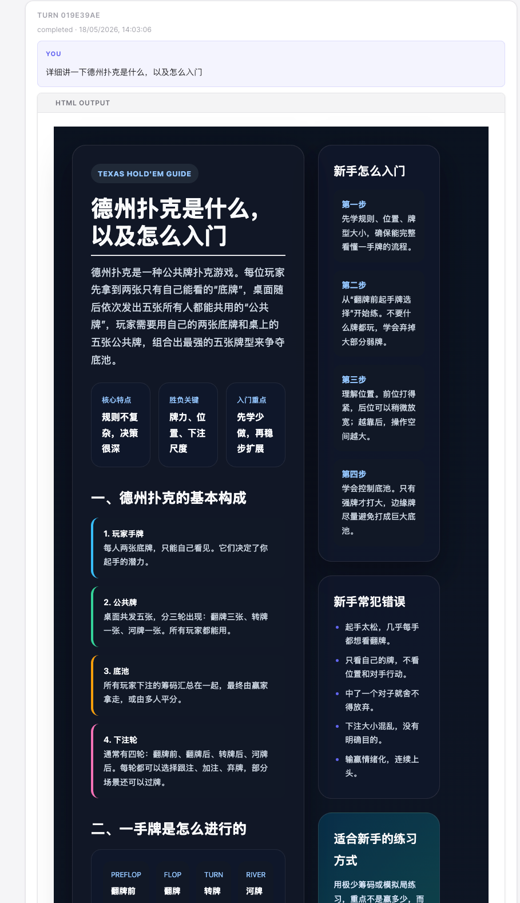
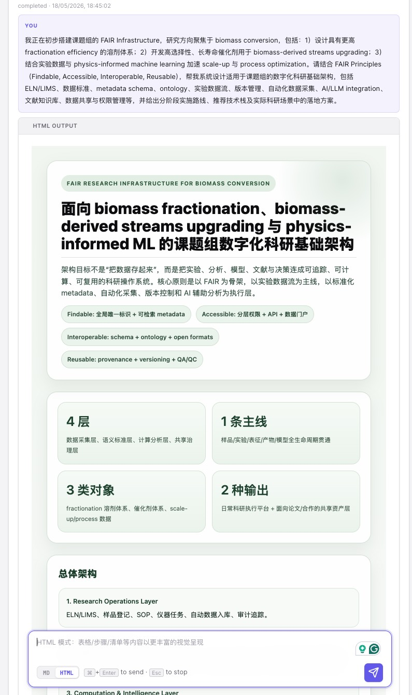

# Codex Studio

**中文** | [English](./README.en.md)

把 Codex CLI 会话搬到浏览器里。不用一直盯着终端，所有输入、输出、历史会话都在浏览器中完成，并且支持 HTML 模式渲染，信息密度更高、展示更直观。

## 界面预览






## 环境要求

- Node.js 20+
- [Codex CLI](https://github.com/openai/codex)

## 安装

```bash
npm install
```

## 启动

```bash
npm run dev
```

浏览器打开 `http://127.0.0.1:4317`

## 配置

复制 `.env.example` 为 `.env`，按需修改：

| 变量 | 说明 | 默认值 |
|------|------|--------|
| `PORT` | 服务端口 | `4317` |
| `WORKSPACE_ROOT` | 默认工作目录 | 当前目录 |
| `CODEX_MODEL` | 覆盖默认模型 | Codex 默认 |
| `CODEX_SANDBOX` | 沙箱模式 | `workspace-write` |
| `CODEX_APPROVAL_POLICY` | 审批策略 | `on-request` |

## 使用

1. 在左上角输入工作目录路径
2. 点击 **New Session** 新建会话
3. 在底部输入框发消息，`⌘ + Enter` 发送，`Esc` 中断
4. 切换到底部 **HTML** 模式，查看更结构化的渲染输出
5. 右上角可以导出当前会话为 Markdown 或 HTML 文件

## GitHub 默认显示中文怎么实现

GitHub 仓库首页默认渲染根目录的 `README.md`，不会根据访问者语言自动切换。所以要“默认显示中文”，做法就是：

1. 把中文内容放在根目录 `README.md`
2. 把英文内容拆到 `README.en.md`
3. 在两个文件顶部互相加跳转链接

这样打开仓库首页时会先看到中文，英文用户再点 `English` 跳转即可。
